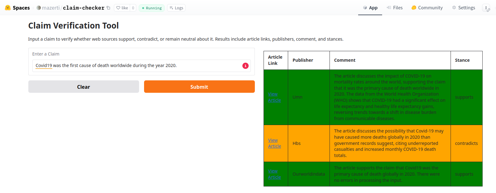
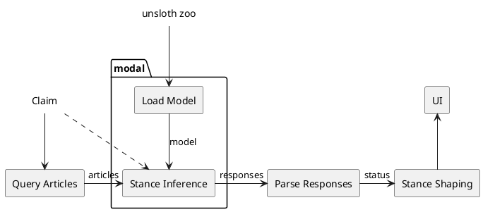

# Claim Checker

#### Find articles to decide if given claim is true or false

The goal of this app is to help everyone to form its own critical thinking, not by offering black or white views about the questioned claims but by presenting the diverse opinions that exists about it on the net as they are, so that the users can make their own opinion and form their media literacy.

### Usage

Go to [https://huggingface.co/spaces/mazerti/claim-checker](https://huggingface.co/spaces/mazerti/claim-checker) and submit a claim to check (for example "ML is easy."). The app usually take about a minute to find all the articles and decides which supports the claim and which contradicts it.



### How it works

The graph below show what happens when a claim is submitted to the app.



1. First a set of articles are queried from the web using the [`googlesearch-python`](https://github.com/Nv7-GitHub/googlesearch) library. These articles are then parsed using the [`newspaper3k`](https://github.com/codelucas/newspaper/tree/master) library.
2. The articles and the claim are given to a Modal function that will form a prompt to ask our language model to give a comment on how each article relates to the claim.
The model we use is [Eugenius0/lora_model_tuned](https://huggingface.co/Eugenius0/lora_model) which is the model we fine-tuned for lab 2 on [meta-llama/Llama-3.2-3B-Instruct](https://huggingface.co/meta-llama/Llama-3.2-3B-Instruct) using [Unsloth](unsloth.ai) We also use Unsloth to access the model and run it for inference.
This step is the most computational heavy and require to be run on a GPU. For this, we use [Modal](modal.com) which provide limited free access to a range of GPUs.
3. The language model's comments are parsed with regular expressions to extract a well structure stance object containing for each article the probability of agreement, disagreement and unrelatedness with the claim.
This object is shaped into a direct stance ("supports", "contradicts", "nuanced" or "unrelated").
4. The responses are given back to the UI for display.

### Run the code locally

If you want to run the app locally, you just have to install the dependencies

```cmd
pip install -r requirements.txt
```

and run the `app.py` file

```cmd
python3 app.py
```

By default, the inference will be handled by Modal. However, if you want to use your local GPU you can easily do so by using the standard python implementation of the inference functions in `inference_local.py`. To do so you must edit the following lines of code in `app.py`:

1. Comment

```python
import modal # line 9
```

and

```python
batch_infer_stances = modal.Function.lookup( # line 36
    "claim-checker", "batch_infer_stances"
)
```

2. Uncomment

``` python
# from inference_local import batch_infer_stances # line 7
```

3. Adapt the calls to `batch_infer_stances` by removing `.remote` (line 41)

### Main Challenges

- **Deploy an app that can do GPU inference anytime.**
The solutions used earlier in the course such as Github actions, Google Colab or Hugging Face Spaces were not enough to deploy this app since Colab only allow to manually run notebooks and the other solutions don't offer free access to GPU. The solution we've picked for this project is to use Modal to run the computation heavy inference on GPU while the rest of the app is managed on a standard CPU in a Gradio Space on Hugging Face.
This decision highlighted the issue that as we don't have persistent access to a GPU the model needs to be loaded efficiently. This is the reason why the inference is made sequentially for all the articles and not in parallel in spite of how easy modal makes it to parallelize: loading the model into the GPU is actually the critical operation, and we prefer to do it only once rather than parallelize the inferences.

- **Efficient querying.**
As we often hear in ML: "Garbage in, garbage out". If we want to have an interesting output it is important to put care into the querying of the articles. We addressed this by enriching the claim with keywords to guide the search engine toward articles and opinion pieces, as well as adding polarizing keywords to get diverse viewpoints on the subject.
In addition, social media websites are excluded from the search so that the sources are easily identifiable.

- **Language model interaction.**
Mitigating the unpredictability of the language model was also a major challenge. We decided to go with a model that we were already familiar with, and tailor the prompt to target our task: analyzing agreement of a text over a given claim. The prompt also required to ask for a precise format of the output so that it could be efficiently parsed. The code for the parser is built to cope with malformed answers from the language model.

---

Check out the configuration reference at <https://huggingface.co/docs/hub/spaces-config-reference>
