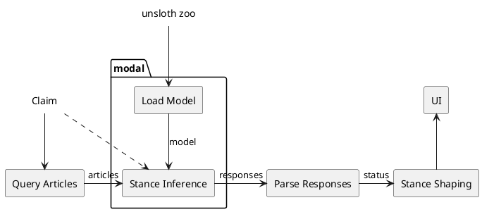

# Claim Checker

#### Find articles to decide if given claim is true or false

### Usage

Go to [https://huggingface.co/spaces/mazerti/claim-checker](https://huggingface.co/spaces/mazerti/claim-checker) and submit a claim to check (for example "ML is easy."). The app usually take about a minute to find all the articles and decides which supports the claim and which contradicts it.

### How it works

The graph below show what happens when a claim is submitted to the app.



1. First a set of articles are queried from the web using the [`python-googlesearch`](https://github.com/Animenosekai/googlesearch) library. These articles are then parsed using the [`newspaper3k`](https://github.com/codelucas/newspaper/tree/master) library.
2. The articles and the claim are given to a Modal function that will form a prompt to ask our LLM to give a comment on how each article relates to the claim.
The model we use is [Eugenius0/lora_model_tuned](https://huggingface.co/Eugenius0/lora_model) which is the model we fine-tuned for lab 2 on [meta-llama/Llama-3.2-3B-Instruct](https://huggingface.co/meta-llama/Llama-3.2-3B-Instruct) using [Unsloth](unsloth.ai) We also use Unsloth to access the model and run it for inference.
This step is the most computational heavy and require to be run on a GPU. For this, we use [Modal](modal.com) which provide limited free access to a range of GPUs.
3. The LLM's comment is parsed with regular expressions to extract a well structure stance object containing for each article the probability of agreement, disagreement and unrelatedness with the claim.
This object is shaped into a direct stance ("supports", "contradicts", "nuanced" or "unrelated").
4. The responses are given back to the UI for display.

### Run the code locally

If you want to run the app locally, you just have to install the dependencies
```
pip install -r requirements.txt
```

and run the `app.py` file
```
python3 app.py
```

By default, the inference will be handled by Modal. However, if you want to use your local GPU you can easily do so by using the standard python implementation of the inference functions in `inference_local.py`. To do so you must edit the following lines of code:

1. In `app.py` comment

```python
import modal # line 9
```

and

```python
batch_infer_stances = modal.Function.lookup( # line 36
    "claim-checker", "batch_infer_stances"
)
```

2. Still on `app.py` Uncomment

``` python
# from inference_local import batch_infer_stances # line 7
```

3. Adapt the calls to `batch_infer_stances` by removing `.remote` (line 41)

---

Check out the configuration reference at <https://huggingface.co/docs/hub/spaces-config-reference>
